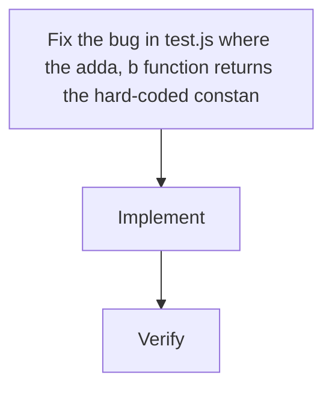

# Functional requirements

Fix the bug in test.js where the add(a, b) function returns the hard-coded constant 3 instead of the sum of its arguments. The fix is a single-line change: replace `return 3;` with `return a + b;` so the function correctly computes the sum of its two parameters. No other code, dependencies, or configuration exists in the repo, and there are no existing tests, so the change is isolated and low-risk.

## Actors

- Developer

## Requirements

### FR-1 · must

The add(a, b) function in test.js must return the arithmetic sum of its two arguments (return a + b;) instead of the hard-coded constant 3.

- add(2, 3) returns 5
- add(0, 0) returns 0
- add(-1, 4) returns 3
- No other exports or behavior in test.js changes

### FR-2 · must

The fix must be minimal: only the return statement inside add is changed; no other files or behavior are touched.

- No new dependencies or config files are added
- Diff is limited to test.js

## Out of scope

- Adding a test framework or CI setup
- Refactoring other code or adding new features
- Changes to any files other than test.js

## Open questions

- (none)

## Visual plan

