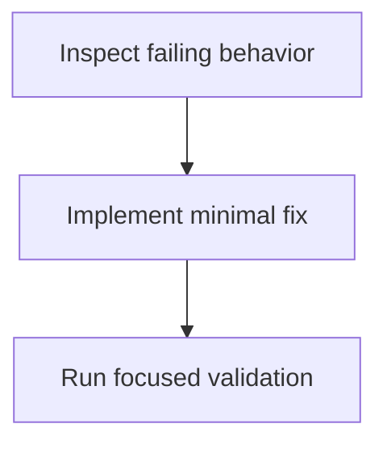

# Functional requirements

Investigate and fix the defect in test.js while preserving its exported add API, then verify the corrected behavior with focused tests or checks.

## Actors

- Developer

## Requirements

### FR-1 · must

Identify and correct the bug in test.js without changing the intended public interface unless the defect requires it.

- The relevant test.js behavior produces the expected result for representative inputs.

### FR-2 · must

Add or update focused coverage for the corrected behavior.

- A repeatable test or validation check passes for the fixed case and existing behavior remains intact.

## Out of scope

- (none)

## Open questions

- (none)

## Visual plan

