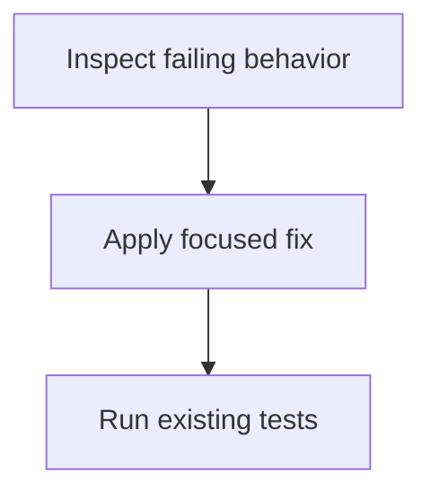

# Functional requirements

Inspect the reported bug in test.js and update its implementation so it satisfies the repository's existing tests, preserving the intended add(a, b) behavior and avoiding unrelated changes.

## Actors

- Developer

## Requirements

### FR-1 · must

Identify and fix the defect in test.js based on the repository's test expectations.

- The existing test suite passes after the change.

### FR-2 · must

Keep the change scoped to the reported test.js bug and preserve the public add(a, b) interface.

- add(a, b) remains exportable and unrelated files or behavior are not changed.

## Out of scope

- (none)

## Open questions

- (none)

## Visual plan

