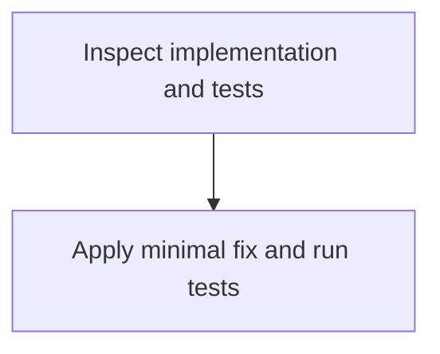

# Functional requirements

Inspect the failing behavior in test.js and its existing test coverage, identify the defect, and implement the smallest compatible correction while preserving the module's public API.

## Actors

- Developer

## Requirements

### FR-1 · must

The defect in test.js must be identified from the implementation and test expectations, then corrected with a minimal code change.

- Existing tests pass after the correction.

### FR-2 · must

The exported add function must continue to accept two inputs and return the expected numeric sum.

- Tests verify add with representative numeric inputs and the bug-revealing case.

## Out of scope

- (none)

## Open questions

- (none)

## Visual plan

