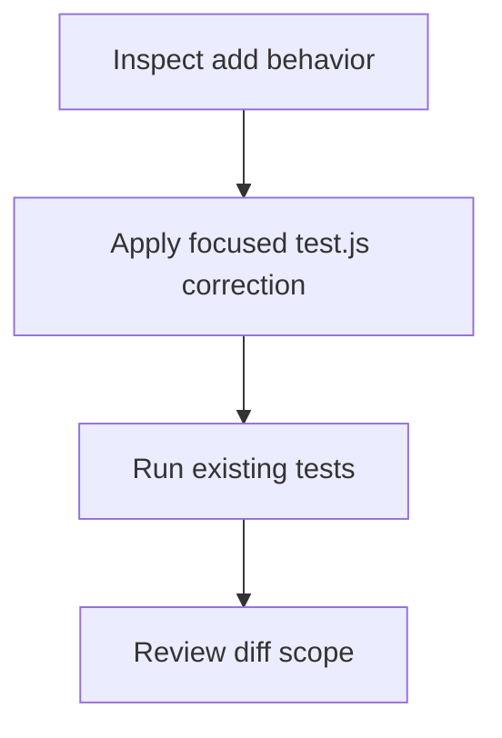

# Update the implementation in test.js with the smallest focused correction needed to satisfy the repository’s existing add(a, b) tests. The named export must remain available, numeric inputs must be added arithmetically, and numeric strings must be coerced before addition so values such as '12' and '30' produce 42 rather than string concatenation. No unrelated files or behavior should be changed.

| Stack | Reason |
|---|---|
| JavaScript (ES modules) | test.js exposes add as a named ES module export and the existing Node test imports it directly. |
| Node.js built-in test runner | The repository’s test.test.js uses node:test and node:assert/strict to verify the add contract. |

## add implementation

Path: `test.js`

Provide the public named add(a, b) function with numeric addition and coercion behavior required by the repository tests.

- export function add(a, b)

## add test suite

Path: `test.test.js`

Verify the named export, arithmetic for numbers, and numeric-string coercion without changing production behavior.

- Node test runner cases

## Data changes

- (none)

## API changes

- (none)

## Risks

- (none)

## Testing

- Run the repository’s existing Node test suite, for example `node --test`, and confirm all tests pass.
- Confirm add remains a named export and returns 5 for add(2, 3), -2.5 for add(-4, 1.5), 5 for add('2', '3'), and 42 for add('12', '30').
- Review the diff to verify that only the focused test.js implementation change is present and that test.test.js and unrelated files are untouched.

