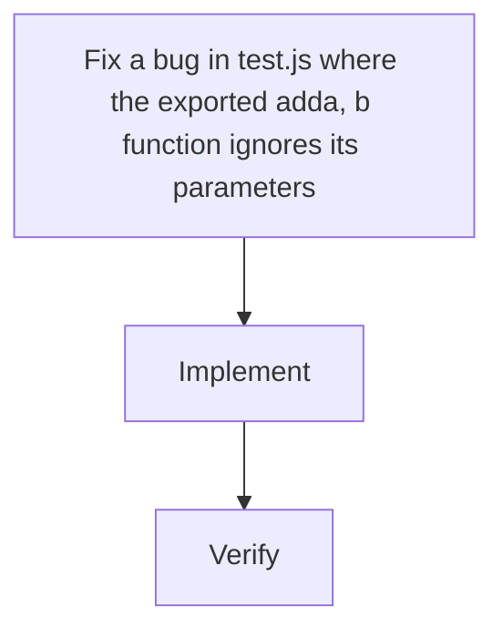

# Fix a bug in test.js where the exported add(a, b) function ignores its parameters and always returns the hard-coded constant 3. The fix replaces `return 3;` with `return a + b;` so the function computes the arithmetic sum of its two arguments. The change is a single line in the single existing source file (test.js); no other code, dependencies, or configuration exists in the repo, so the change is isolated and low-risk.

| Stack | Reason |
|---|---|
| JavaScript (ES Modules) | test.js already uses ESM (export function ...); the fix is pure JS arithmetic with no new dependencies or transpilation. |

## app

Path: `.`

Fix a bug in test.js where the exported add(a, b) function ignores its parameters and always returns the hard-coded constant 3. The fix replaces `return 3;` with `return a + b;` so the function computes the arithmetic sum of its two arguments. The change is a single line in the single existing source file (test.js); no other code, dependencies, or configuration exists in the repo, so the change is isolated and low-risk.

## Data changes

- None — no data, schema, or storage is involved.

## API changes

- (none)

## Risks

- (none)

## Testing

- Run `node -e "import('./test.js').then(m => { console.assert(m.add(2, 3) === 5); console.assert(m.add(0, 0) === 0); console.assert(m.add(-1, 4) === 3); })"` (or node --input-type=module) and confirm no assertion failures.
- Visually inspect `git diff` to confirm the only change is `return 3;` → `return a + b;` in test.js.
- Optionally run `node test.js` to confirm the file still parses/loads as a valid ES module.

