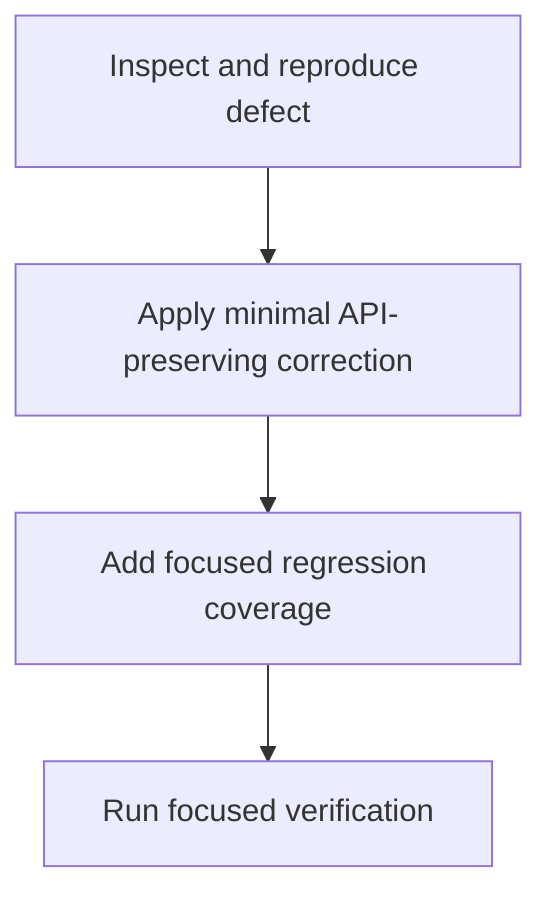

# Technical specification

Inspect the current implementation of the exported add function in test.js, reproduce the defect using representative inputs, and apply the smallest corrective change while preserving the existing named export and intended public API. Add focused automated coverage for the failing case plus representative existing behavior, then run the repository’s available JavaScript validation command or an equivalent direct check to confirm the fix and guard against regressions.

## Stack

| Package | Why |
| --- | --- |
| JavaScript ES modules | test.js exposes the add function as a named ES module export, so the implementation must retain that interface. |
| Node.js test/check tooling | Use the repository’s available JavaScript test runner or a minimal Node-based validation check for repeatable focused coverage. |

## add implementation

`test.js`

Diagnose and correct the defect in add while retaining the exported add(a, b) API and expected behavior for representative inputs.

- export function add(a, b)

## focused regression coverage

`test file to be added or updated alongside test.js`

Exercise the corrected failing case and representative normal cases, asserting the expected results and preserving the public export contract.

- Imports add from test.js
- Assertions for corrected behavior

## Data changes

- (none)

## API changes

- (none)

## Risks

- (none)

## Testing

- Inspect and reproduce the reported defect before changing implementation.
- Add focused assertions for the failing input(s), including representative valid inputs and any edge case implicated by the defect.
- Verify that add remains available through the same named export and that existing expected behavior is unchanged.
- Run the repository’s available test command; if no test runner is configured, run the focused check directly with the supported Node.js module mode.
- Confirm the focused regression check passes after the minimal fix.

## Visual plan

- **n1** Inspect and reproduce the defect
- **n2** Apply the minimal API-preserving correction
- **n3** Add focused regression coverage and verify

