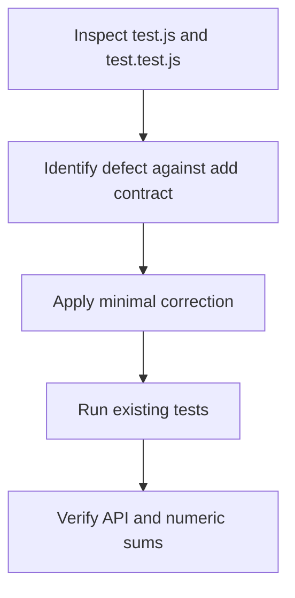

# Technical specification

Inspect test.js and test.test.js to reconcile the reported failure with the existing add-function contract, then apply the smallest compatible correction in test.js. The named export add must remain available, accept two inputs, coerce numeric strings as currently covered, and return their numeric sum without changing the public API or introducing unrelated behavior.

## Stack

| Package | Why |
| --- | --- |
| JavaScript (ES modules) | The implementation and tests are JavaScript modules, and the existing named-export API must be preserved. |
| Node.js built-in test runner | The repository's test.test.js uses node:test and node:assert/strict for verification. |

## add implementation

`test.js`

Export the add(a, b) function and implement the minimal correction needed to produce the expected numeric sum for supported inputs.

- Named export add(a, b)
- Returns a numeric sum
- Accepts numeric values and numeric-string inputs covered by existing tests

## add tests

`test.test.js`

Verify export availability, numeric addition, negative/fractional values, and numeric-string coercion including the bug-revealing case.

- Node.js test runner cases
- Strict equality assertions

## Data changes

- (none)

## API changes

- (none)

## Risks

- (none)

## Testing

- Run the existing Node.js test suite with the repository's available test command or directly via node --test test.test.js.
- Confirm the named add export remains a function.
- Confirm representative positive, negative, fractional, and numeric-string inputs return the expected numeric sums.
- Confirm the bug-revealing regression case passes after the minimal change.
- Review the final diff to ensure only the necessary implementation change is included.

## Visual plan

- **n1** Inspect implementation and expectations
- **n2** Apply the minimal compatible correction in test.js
- **n3** Run regression tests and review the diff

